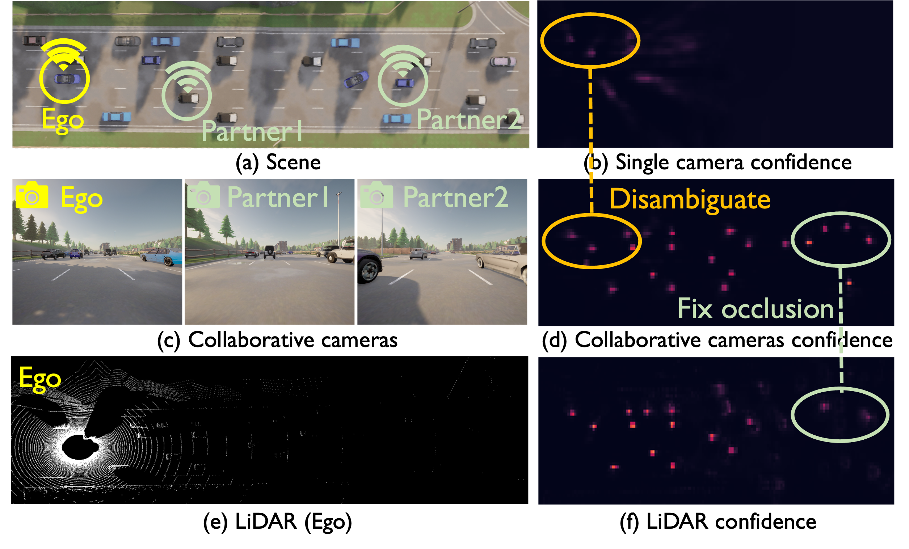
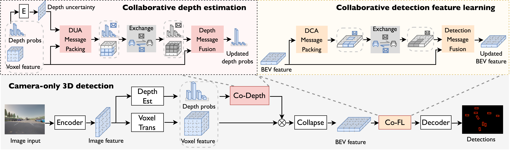

# Where2comm
[](https://opensource.org/licenses/MIT) 

This repository contains the official PyTorch implementation of

[**Collaboration Helps Camera Overtake LiDAR in 3D Detection</a>**](https://arxiv.org/abs/2303.13560)
<br>
<a href="https://scholar.google.com/citations?user=XBbwb78AAAAJ&hl=zh-CN"> Yue Hu, <a href="https://github.com/yifanlu0227"> Yifan Lu, <a href="https://derrickxunu.github.io//">Runsheng Xu, <a href="https://weidixie.github.io/"> Weidi Xie, <a href="https://siheng-chen.github.io/">Siheng Chen, <a href="https://mediabrain.sjtu.edu.cn/members/">Yanfeng wang</a> 
<br>
Presented at [CVPR 2023](https://cvpr2023.thecvf.com/)


<div align='center' ><font size='2'>LiDAR detection v.s. collaborative camera perception</font></div>


## Main idea
**Abstract:** Camera-only 3D detection provides an economical solution with a simple
configuration for localizing objects in 3D space compared to LiDAR-based
detection systems. However, a major challenge lies in precise depth estimation
due to the lack of direct 3D measurements in the input. Many previous methods
attempt to improve depth estimation through network designs, e.g., deformable
layers and larger receptive fields. This work proposes an orthogonal direction,
improving the camera-only 3D detection by introducing multi-agent
collaborations. Our preliminary results show a
potential that with sufficient collaboration, the camera might overtake LiDAR
in some practical scenarios. 



## Features

- Dataset Support
  - [x] DAIR-V2X
  - [x] OPV2V+
  - [x] V2X-SIM

- SOTA collaborative perception method support
    - [x] [Where2comm [Neurips2022]](https://arxiv.org/abs/2209.12836)
    - [x] [V2VNet [ECCV2020]](https://arxiv.org/abs/2008.07519)
    - [x] [DiscoNet [NeurIPS2021]](https://arxiv.org/abs/2111.00643)
    - [x] [V2X-ViT [ECCV2022]](https://arxiv.org/abs/2203.10638)
    - [x] [When2com [CVPR2020]](https://arxiv.org/abs/2006.00176)
    - [x] Late Fusion
    - [x] Early Fusion

- Visualization
  - [x] BEV visualization
  - [x] 3D visualization

## Citation

If you find this code useful in your research then please cite

```
@inproceedings{Where2comm:22,
  author    = {Yue Hu, Yifan Lu, Runsheng Xu, Weidi Xie, Siheng Chen, Yanfeng Wang},
  title     = {Collaboration Helps Camera Overtake LiDAR in 3D Detection},
  booktitle = {The IEEE/CVF Conference on Computer Vision and Pattern Recognition (CVPR)},
  year      = {2023}
}
```

## Quick Start
### Install
Please refer to the [INSTALL.md](./docs/INSTALL.md) for detailed 
documentations. 

### Download dataset DAIR-V2X
1. Download raw data of [DAIR-V2X.](https://thudair.baai.ac.cn/cooptest)
2. Download complemented annotation from [Yifan Lu](https://github.com/yifanlu0227/CoAlign).


### Train your model
We adopt the same setting as OpenCOOD which uses yaml file to configure all the parameters for training. To train your own model from scratch or a continued checkpoint, run the following commonds:
```python
python opencood/tools/train.py --hypes_yaml ${CONFIG_FILE} [--model_dir  ${CHECKPOINT_FOLDER}]
```
Arguments Explanation:
- `hypes_yaml`: the path of the training configuration file, e.g. `opencood/hypes_yaml/second_early_fusion.yaml`, meaning you want to train
an early fusion model which utilizes SECOND as the backbone. See [Tutorial 1: Config System](https://opencood.readthedocs.io/en/latest/md_files/config_tutorial.html) to learn more about the rules of the yaml files.
- `model_dir` (optional) : the path of the checkpoints. This is used to fine-tune the trained models. When the `model_dir` is
given, the trainer will discard the `hypes_yaml` and load the `config.yaml` in the checkpoint folder.

### Test the model
Before you run the following command, first make sure the `validation_dir` in config.yaml under your checkpoint folder
refers to the testing dataset path, e.g. `opv2v_data_dumping/test`.

```python
python opencood/tools/inference.py --model_dir ${CHECKPOINT_FOLDER} --fusion_method ${FUSION_STRATEGY} --save_vis_n ${amount}
```
Arguments Explanation:
- `model_dir`: the path to your saved model.
- `fusion_method`: indicate the fusion strategy, currently support 'early', 'late', 'intermediate', 'no'(indicate no fusion, single agent), 'intermediate_with_comm'(adopt intermediate fusion and output the communication cost).
- `save_vis_n`: the amount of saving visualization result, default 10

The evaluation results  will be dumped in the model directory.

## Acknowledgements
Thank for the excellent cooperative perception codebases [OpenCOOD](https://github.com/DerrickXuNu/OpenCOOD) and [CoPerception](https://github.com/coperception/coperception).

Thank for the excellent cooperative perception datasets [DAIR-V2X](https://thudair.baai.ac.cn/index), [OPV2V](https://mobility-lab.seas.ucla.edu/opv2v/) and [V2X-SIM](https://ai4ce.github.io/V2X-Sim/).

Thanks for the insightful previous works in cooperative perception field. [Where2comm](https://arxiv.org/abs/2008.07519)(NeruIPS22), [CoAlign](https://arxiv.org/abs/2211.07214)(ICRA23), [V2VNet](https://arxiv.org/abs/2008.07519)(ECCV20), [When2com](https://arxiv.org/abs/2006.00176)(CVPR20), [Who2com](https://arxiv.org/abs/2003.09575?context=cs.RO)(ICRA20), [DiscoNet](https://arxiv.org/abs/2111.00643)(NeurIPS21), [V2X-ViT](https://arxiv.org/abs/2203.10638)(ECCV2022), [STAR](https://openreview.net/forum?id=hW0tcXOJas2)(CoRL2022), 
[CoBEVT](https://arxiv.org/abs/2207.02202)(CoRL2022).


## Contact

If you have any problem with this code, please feel free to contact **18671129361@sjtu.edu.cn**.